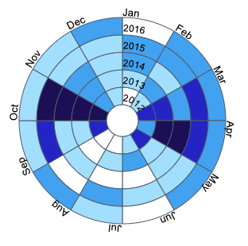

# Visualization Project Air Pollution Data Analysis

## Introduction
The quality of air condition in Taiwan used to be pretty good. However, in recent years, the quality becomes worse and worse every year. People never experienced such blur eyesight before. Many people claim that with the rapid development of environment demanding industries, the quality of air rapidly worsen. Yet, some might argue that it is due to the air pollutions brought by the wind blows from China, instead of those local factories.

In our final project, we utilize the geographical and time-series visualization techniques to help people find out the possible causes of air pollution; to help people predict future air conditions based on the current pattern; to help people make decisions like "which city should I travel for health concern?" or "In which area should we enforce environmental protection regulations?". 

Our system contains following components: 
* **A time-series line chart** - which displays all historical data in five years; 
* **A circular heatmap** - which reveals the change patterns of values in a yearly-base;
* **A parallel coordinate** - which compares the relations between specific pollutants (at most four items);
* **A scatter plot matrix** - which helps users identify correlation between different variables. 

Our system is very user-interactive. The users could click on the Google map to see the air pollution data on that location. Also, they could select several variables to analyze their correlation via drop-down lists. They could select a specific time period of data to focus on further detailed information and changes by using the adjustable timeline. 

## Data Source
All data are downloaded from the Taiwan government official sites. (Note that some of them does not have English version.)

#### 1.	Air quality historical data:
* http://taqm.epa.gov.tw/taqm/en/YearlyDataDownload.aspx 
* http://erdb.epa.gov.tw/ENG/DataRepository/EnvMonitor/AirQualityMonitorMonData.aspx 

#### 2.	Station ID geographical data:
* http://dacet.rcec.sinica.edu.tw/ch/main/readme.php?source=epa (Mandarin only)

#### 3.	Number of Registered Air Pollutant of all factories:
* http://data.gov.tw/node/9844 (Mandarin only)

#### 4.	Number of Registered Motor Vehicles and Density
* http://erdb.epa.gov.tw/ENG/DataRepository/ReportAndStatistics/StatSceMotors.aspx

## Data Pre-processing
All data pre-processing are handled using Python. When dealing with air quality historical data, we need to replace all unknown value to zero or some meaningful value. Here, the original data use special characters to denote the value is invalid. For example,
* \#      means the value is detected as invalid by instruments. 
* \*      means the value is detected as invalid by computer programs. 
* x     means the value is detected as invalid by human beings.
* blank   means the value is missing. 
For simplicity, all invalid data are currently replaced by 0.

Besides, there are totally 21 possible types of collected values: SO2, CO, O3, PM10, PM2.5, …, etc. However, data at each monitoring station contains different subsets of these types. So, in the output file, some columns of collecting data are remaining all zeros, which means not available in this station.

## Components

### 1.	Historical Area/Line Chart:

The historical line chart displays information as a series of data points connected by straight line segments. Here, we show all the historical data of one specific item at one station. Generally speaking, a line chart is often useful to visualize a trend in data over time. 
  
In the figure, there are four parts.

  #### Line/Area Chart with brush:
The data starts from 2012 Jan to 2016 Dec. First, the blue area shows the monitoring value in a day, which represents the day average value of specific collecting data at a station. Second, the black line depicts the monthly average data, which represents the monthly average value of specific collecting data at a station. The average data is useful to show a trend in a long period. For example, this figure shows all data of PM2.5 in the Mailiau station from January to December in 2015. From the black line, we can easily find that the pollution of PM2.5 in the winter is much more serious than in the summer.
The users can zoom in and out to find the data change in a specific period. They also can use the selecting tool to choose a specific time period.
  
  #### Adjustable timeline:
This component is used for the users to choose a specific period they want to focus on. Here are four ways to select a period of time. First, you can use two white bars to increase or decrease the length of period. Second, you can just directly select a region outside the grey block. Third, you can move the grey block. Fourth, you can choose the block of a specific month in the circular heat map.
  
  #### Input data selector:
The users can choose which type of collecting data they are focusing on. The users could choose every station they want. Circular heatmap and historical line chart are combined together and will automatically be updated when one part is changed.
  
  #### Highlight tool:
This tool highlights the data which exceeds a specific value using a red bar. Those red bars indicated the value exceed the selected threshold. The slider is used to increase or decrease the threshold. It is useful to let us know how many days the polution value are exceed the threshold.

Ref: https://bl.ocks.org/mbostock/34f08d5e11952a80609169b7917d4172

### 2. Circular Heatmap

A circular heatmap is a graphical representation of data where the individual values contained in a circle shape. It displays quantitative data as an array of circular segments, colored according to value. It is a good way to display cyclic data in a well-chosen time period, in order to show a pattern as value changes.

Since our data cover from 2012 January to 2016 December, there are totally 60 blocks. Each black represents the monthly average data of the selected attribute. For example, we observe the changes of PM2.5 at the Tucheng station. It is obvious to tell that the PM2.5 pollution in winter is much more serious than that in summer, and every year has this pattern. If we look through all PM2.5 value of all stations, we can find all stations have the same property. With this observation, we can suggest people in Taiwan avoiding outdoor activity. Or, if some travelers want to visit Taiwan in winter, we could suggest notify them of bad air condition.

Ref: http://bl.ocks.org/arpitnarechania/b0bdc4f9a377ea9d8612677e12f65b82

### 3. Parallel Coordinates

Parallel coordinates is a popular way to visualize high-dimensional dataset and analyzing the relationship between different dimension data. There are k-vertical parallel axes, corresponding to the dimension of input data. The position of the vertex on the i-th axis corresponds to the i-th coordinate of the point. Since the order of axes in parallel coordinates is important, here we allow the users to choose the order by using drop-down lists. The first axis is year and the second axis is month in a year, and they are fixed because it is easy to understand which time period of data is selected.

From parallel coordinates, it is easy to know the relationship between two dimensions. That is, if there is a positive relationship between two dimensions, in the figure we could find most lines between two parallel axes are somewhat parallel to each others. When most lines cross look like X-shapes, it means two dimension negative relationship. When most lines cross randomly, it shows that there is no obvious relationship. 

For example, the lines between axes of PM2.5 and PM10 are mostly parallel, which means both pollutants are highly related to each other. It is intuitive because they are both represents toxic particles found in the air, including dust, dirt, soot, smoke, and liquid droplets, only different in size of particles. However, aces of PM10 and wind speed are obviously negatively related. It is also intuitive because strong wind can blow toxic particles to nearby regions and bring fresh air from rural area or sea. Also, both axes of PM2.5 and month are kind of negatively related because lines are x-crossed. This finding matches to the observation in line chart and circular heat map. Another interesting finding is that the wind-direction are correlated with the concentration of PM2.5 and PM10. In Taiwan during the winter, there are strong northeastern Monsoon which is originated from northwestern part from China. It implies that air pollutions in Taiwan is kindly related to those in China.

The list below shows correct values of all coordinates in a year. Besides, this figure also supports brushing. We can choose a region an axis to show only small parts of data. The list will be updated based on selected region automatically.

Ref: http://bl.ocks.org/eesur/1a2514440351ec22f176

### 4. Scatter Plot Matrix

The scatter plot matrix shows all the pair-wise scatter plots of the variables on a single view with multiple scatterplots in a matrix format. We implemented a 3 by 3 matrix of scatterplots. Generally speaking, the scatterplot matrix is a great way to roughly determine if any two of the input variables have obvious correlation. 

Here, we show all data of three attributes at a station. At top of the figure, there is three drop-down lists for users to choose which attributes are now focused on. All the points are categorized by twelve colors: Red, Green, Blue, Yellow, purple, and so on. However, we cannot find any relationship between months.

Ref: https://bl.ocks.org/mbostock/4063663

## Analysis

### 1.	Relationship between pollutants and time
General speaking, the air quality is worse in winter than in summer. In circular heat map, when looking through all pollutants at a station, the value in winter is always higher than in summer.
Also, from the circular heatmap we could find that thoroughly speaking, the air pollution is not getting worse in recent 5 years. From our analysis, the worst year in terms of PM2.5 is 2012~2014, and somehow last year-2016 is below average. 

### 2.	Relationship between pollutants and location
In general, the air quality in west Taiwan is greatly worse than in east Taiwan. It is very intuitive because west Taiwan is highly developed than east part. Big cities, such as Taipei, Taichung and Kaohsiung, are crowed in the east side. Factories and vehicles in those cities produce a huge amount of polluted air. Yet, in the center Taiwan, there are huge mountains across from north to east, the so-called central mountains. They acts like a wall to protect air pollution move from west to east. So the air quality in east Taiwan is much better.

From map view, we can find an interesting observation -- the most serious polluted location of every pollutant is quite different. The finding is not quite known for most people in Taiwan. For example, the highest value of SO2 occurs at Kaohsiung city. This is probably because there are the biggest steelworks (China Steel Corporation), the biggest oil refinery (Chinese Petroleum Corporation) in Taiwan and many thermal power plants. Those factories provide higher sulfur compounds than other areas.

For another, the highest value of CO, NO, NO2 and NOx occur at Taipei city. In our guess, the major sources for these pollutants are vehicles. The main reason might be millions of cars and motorcycles are crowded in Taipei area (Taipei City + New Taipei City). From the government official site, we found the data of Registered Motor Vehicles. If sorted by total number of vehicles, we found Taipei area is as twice as much than Kaohsiung or Taichung city.
  
If we look closer, we will found Taipei city is a basin, which is difficult for air circulation (fresh air comes in and polluted air leaves). Thus, polluted air from vehicles is higher than other cities in Taiwan. 

### 3.	Relationship between two attributes

From our current visualization of scatter plot matrix, we find that there is no obvious correlation between pollution sources, except some similar pollutants like PM2.5/PM10 as well as NO/NO2/NOx. It is trivial because most pollution resources are independent variables, and they have no effect with each other. For example, although CO and PM2.5 might be high simultaneously, they are not the cause of each other. 

On the other hand, ambient variables like temperature and rainfall has high correlation with pollutants. For example, in the winter the air quality are worse than in the summer. And after rainfall, the monitored value of pollutants becomes lower. If we do further analysis by comparing every station's geographical information, we see that the pollution condition in west Taiwan is much severe than in eastern Taiwan. This is obvious because the west side of Taiwan is more developed than the east side, and there are many big cities and factories in the west Taiwan.
